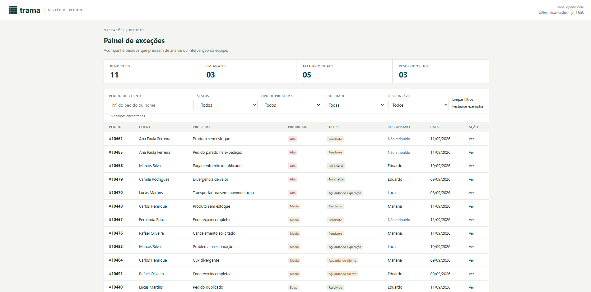
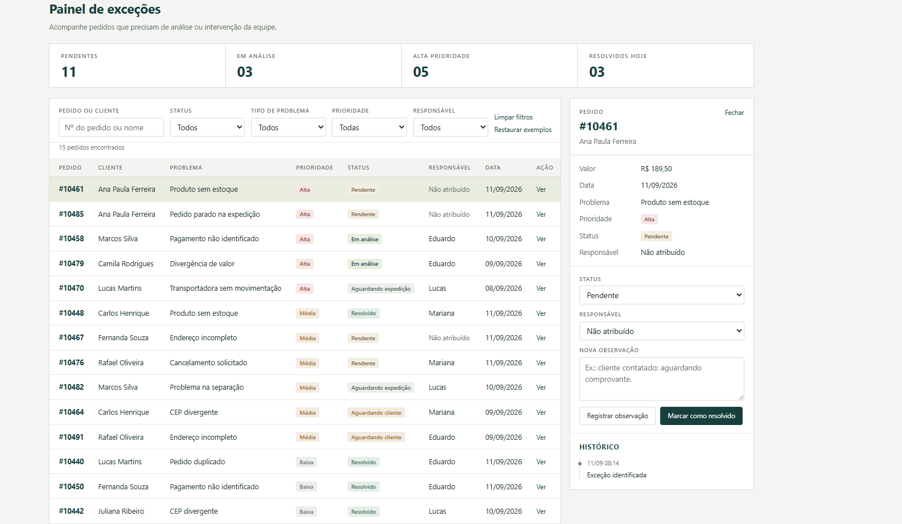

# Painel de Exceções de Pedidos





Projeto desenvolvido em React para simular um painel interno de acompanhamento de pedidos que precisam de intervenção operacional.

A aplicação utiliza a empresa fictícia Trama como contexto e reúne situações comuns de uma operação de pedidos, como divergências de estoque, problemas de pagamento, endereço e transporte.

## Funcionalidades

- pesquisa de pedidos;
- filtros por status, prioridade e tipo de problema;
- visualização dos detalhes do pedido;
- alteração de responsável;
- atualização de status;
- registro de observações;
- persistência local das alterações.

## Tecnologias

- React
- JavaScript
- HTML
- CSS
- Vite

## Objetivo

O projeto foi desenvolvido para praticar componentização, gerenciamento de estado, manipulação de dados e construção de interfaces administrativas com React.

## Como executar

```bash
npm install
npm run dev
```

As alterações ficam salvas no navegador. Use “Restaurar exemplos” para voltar aos pedidos iniciais.
